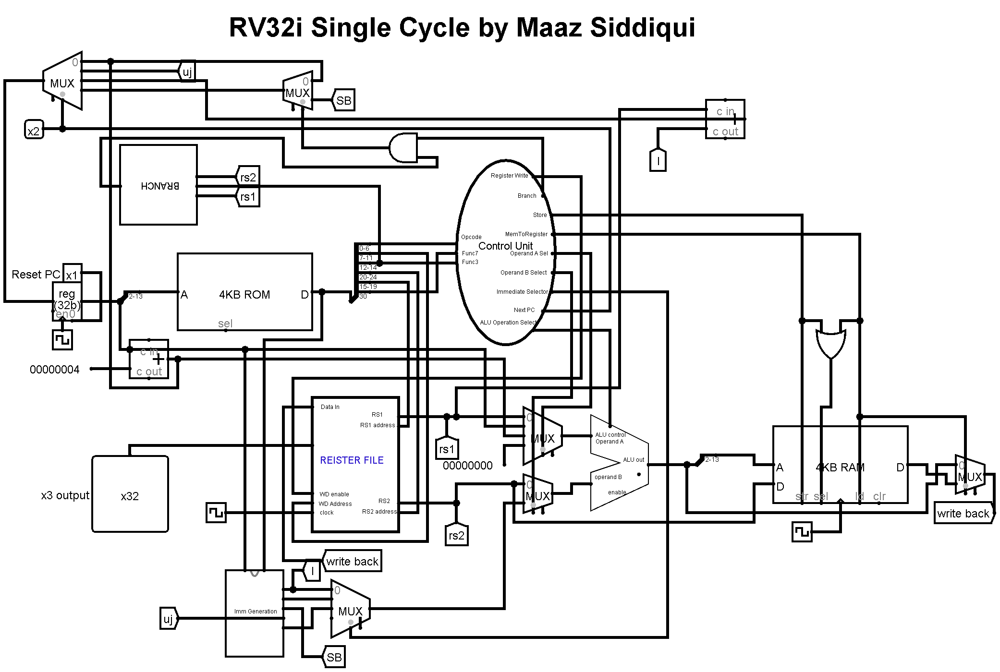

# RV32I Single Cycle Logisim Simulation

## **Description**
This repository contains RISC-V Single Cycle 32 Bit Processor simulation on Logic Simulator called [Logisim.](http://www.cburch.com/logisim/download.html) This circuit contains 32 bit ALU, 32 bit Data Bus, 16KB ROM/RAM, 12 Bit Address Bus for both RAM  MAR(memory address register). Register File contains 32 Registers with data width of 32 bits. Troubleshooting codes used to verify all the circuit components.

## **Componenents**
- ALU
- Register File
- Memory Address Register
- Immediate Generation
- Control Unit
   - Type Decode
   - Control Decode
- RAM
- Branch Circuit
- Program Counter

## **Reference Material**
- Book [David_A._Patterson,_John_L._Hennessy](https://drive.google.com/file/d/1zJ5JT1A-pmruRShfD6ikY52tFlcvrdYB/view?usp=sharing)
- Online RV32I Simulator [Venus](https://venus.cs61c.org/)

## **Under The Guidance Of**
- [Zeeshan Raffique](https://github.com/zeeshanrafique23)
- [Sajjad Ahmed](https://github.com/sajjadahmed677)

## **Pre-Req Tools**
- Logisim Software [Logisim.](http://www.cburch.com/logisim/download.html)
- Reference book for help [David_A._Patterson,_John_L._Hennessy](https://drive.google.com/file/d/1zJ5JT1A-pmruRShfD6ikY52tFlcvrdYB/view?usp=sharing)
- Venus online simulator [Venus](https://venus.cs61c.org/)
- Github [Github](https://github.com)
- Git [Git](https://git-scm.com/downloads)

## **Designing Procedure**
At first learn the basic instructions of the RV32I Instruction Set Architecture and learn their functionality. To learn the backend working use Venus Online RV32I Simulator. This Simulator helps grasp the working behind the instruction much faster. On the Logic Simulator software first start with the program counter and memory address register. Then develop the circuit for the immediate generation which uses full instruction and PC to generate respective immediate. after that create register file with 32 registers each 32-bit data width. This register file takes 5-bit address to select one of the 32 registers and write data to it using register enable wire. two 5-bit address RS1 and RS2 are to read one of the 32 registers simultaneously. Now make 32 Bit ALU with 4-bit ALU operation Select which selects which operation to perform according to the instruction. After completing create type decoder which uses 7-bit opcode to decode the type of the instruction. Then in control Decoder depending upon the type of instruction, function3 and function7 different components are controlled. Integrate type decode and control decode, and this will become your control unit. Add RAM and configure its data bits to 32bit and address width to 12 bits. To handle branch instruction Branch circuit is now having to be created using the simple comparators and depending upon the RS1 and RS2 conditional jump is done if branch is true. In the end Add a 32-bit adder for jalr as this instruction requires two additions. One ALU cannot perform 2 operation on a single cycle. Connect the wiring using the splitters, multiplexers, constants, tunnels, and clocks. To troubleshoot the circuit, start with the simpler instructions e.g.; add, addi and watch the circuit behavior using temporary register outputs. To load the machine code on the Instruction Register, simulate the code on Venus then using dump feature copy the machine code and create xyzcode.mem extension file using All file saving option on notepad :
``` 
v2.0 raw
00000193
00118193
FFDFF06F
``` 
_(remove 0x0 before saving as .mem extension and loading into Instruction Register)_

Match the register output of each instruction according to the output observed on Venus Online Simulator. During all this circuit designing make notes of each components so that it would help greatly during the troubleshooting phase. Also upload this circuit from the day 1 to GitHub remote repository which can help you rewind your circuit to a previous phase if some mishap happens.


## **Instructions Supported**

1. add
2. addi
3. sub
4. xor
5. and
6. slt
7. sltu
8. sll
9. srl
10. sra
11. lw
12. jalr
13. slli
14. srli
15. srai
16. slti
17. sltiu
18. sw
19. auipc
20. lui
21. li

## **Circuit SnapShot**


>_The quieter you become, the more you are able to hear._


